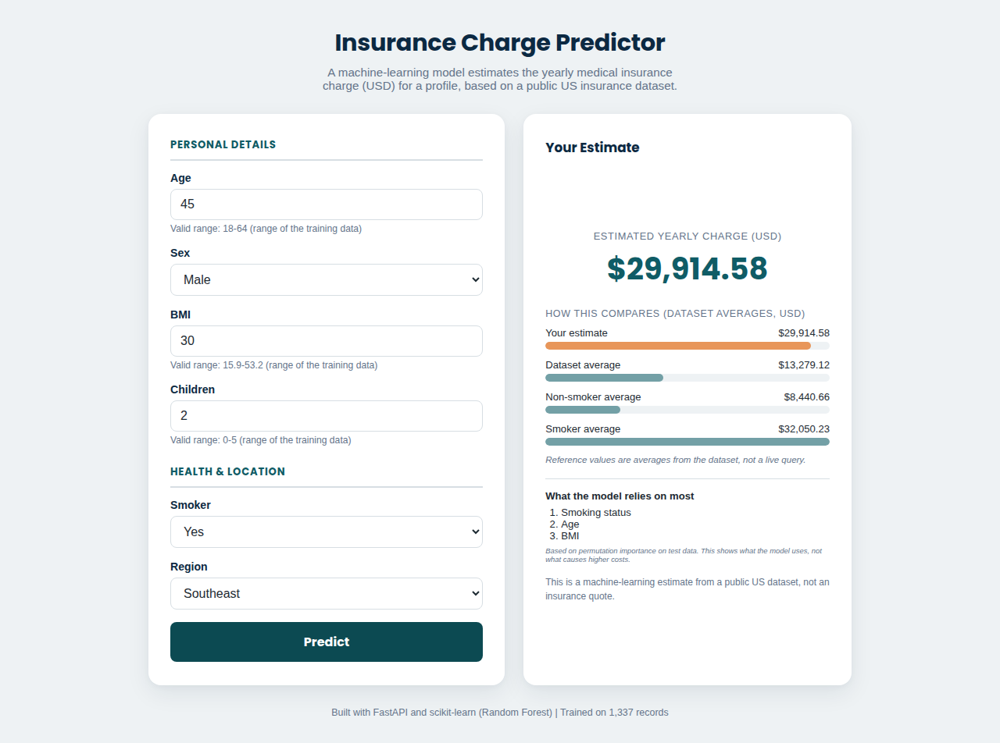
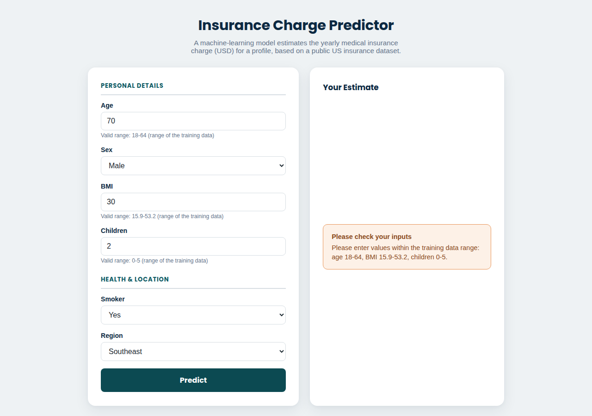

# Insurance Charge Predictor

A machine-learning web app that estimates a person's yearly medical insurance charge (USD) from age, sex, BMI, number of children, smoking status and US region. It includes a reproducible training script that compares three regression models, a FastAPI backend, and a simple web form.

**Live demo:** https://medical-insurance-charge-predictor.onrender.com (free Render instance, so the first load can take about a minute)

## Overview

Insurance charges vary a lot between people. This project trains a regression model on a public US dataset and serves it through a small web app, so anyone can enter a profile and get an estimated yearly charge, compared against dataset averages.

It is a learning and portfolio project. The estimate comes from historical data and is **not** an insurance quote.

## Features

- Estimated yearly insurance charge from 6 inputs
- Reproducible training pipeline (`train.py`) with a fixed random seed
- Comparison of 3 models with 5-fold cross-validation
- Preprocessing inside a scikit-learn `Pipeline` (no data leakage, no manual encoding at prediction time)
- Input validation based on the range of the training data, in both the API and the form
- Permutation importance to show which inputs the model relies on
- Web form, JSON API (`/predict`) and a command-line tool (`predict.py`)
- Automated tests with pytest

## Tech Stack

**Machine learning:** Python, pandas, NumPy, scikit-learn, joblib
**Application:** FastAPI, Uvicorn, Pydantic, HTML/CSS/JavaScript (no framework)
**Testing:** pytest
**Deployment:** Render

## Dataset

| | |
|---|---|
| Data | Medical insurance charges, 1,338 rows, 7 columns, no missing values |
| Source of this copy | [stedy/Machine-Learning-with-R-datasets](https://github.com/stedy/Machine-Learning-with-R-datasets/blob/master/insurance.csv) (the same data is published on Kaggle) |
| Cleaning | 1 exact duplicate row removed, leaving 1,337 rows |
| Target | `charges`: yearly medical charges billed by insurance, in USD |
| Features | `age` (18–64), `sex`, `bmi` (16.0–53.1), `children` (0–5), `smoker`, `region` (northeast, northwest, southeast, southwest) |

The data is from the United States only and is relatively small.

## Machine Learning Workflow

```text
data/insurance.csv
      ↓  remove 1 duplicate row
Train/test split (80/20, random_state=42)
      ↓
Pipeline: one-hot encode sex, smoker, region → model
      ↓
5-fold cross-validation on the training set → pick lowest MAE
      ↓
Fit on full training set → evaluate once on the test set
      ↓
Permutation importance → save pipeline + model_info.json
      ↓
FastAPI app / CLI loads the pipeline and predicts
```

- **Encoding:** `OneHotEncoder(drop="first")` inside a `ColumnTransformer`. Because it is part of the pipeline, it is fitted only on the data the model is trained on.
- **Scaling:** not used. Tree models ignore feature scale, and plain linear regression gives the same predictions with or without it.
- **Model selection:** uses cross-validation on the training set only. The test set is used once, for reporting.
- **Hyperparameters:** reasonable fixed values, not tuned.

## Results

From `python train.py` (also saved in `models/model_info.json`). MAE and RMSE are in USD.

| Model | CV MAE | CV RMSE | CV R² | Test MAE | Test RMSE | Test R² |
|---|--:|--:|--:|--:|--:|--:|
| Linear Regression (original model) | 4,222 | 6,124 | 0.723 | 4,177 | 5,956 | 0.807 |
| **Random Forest (selected)** | **2,599** | **4,657** | **0.838** | **2,445** | **4,327** | **0.898** |
| Gradient Boosting | 2,638 | 4,715 | 0.834 | 2,509 | 4,254 | 0.901 |

- **MAE:** the average size of the error in dollars.
- **RMSE:** like MAE, but punishes large errors more.
- **R²:** the share of the variation in charges that the model explains (1.0 = perfect).

Random Forest was selected because it had the lowest cross-validated MAE. Gradient Boosting is slightly better on test RMSE and R², but the two are very close, and choosing based on the test set would make the test score less trustworthy.

**Why the model changed:** the first version used Linear Regression, which can predict **negative** charges for young, healthy profiles (for example, age 18, female, BMI 20, non-smoker, southeast gave −$1,089.75). The tree models never predict below the range of real charges and have about 40% lower MAE.

### What the model relies on

Permutation importance on the test set (how much the test MAE rises when one input is shuffled):

| Feature | MAE increase (USD) |
|---|--:|
| smoker | 7,862 |
| age | 2,798 |
| bmi | 1,925 |
| children | 291 |
| region | 56 |
| sex | −12 (no useful signal) |

This shows what the **model** uses for its predictions. It does not prove that a feature **causes** higher charges.

## Project Structure

```text
Insurance Charge Predictor/
├── data/
│   └── insurance.csv            # dataset
├── models/
│   ├── insurance_model.joblib   # trained pipeline (preprocessing + Random Forest)
│   └── model_info.json          # metrics, input ranges, averages, importance
├── screenshots/                 # app screenshots used in this README
├── static/
│   └── index.html               # web form (HTML/CSS/JS)
├── tests/
│   ├── conftest.py
│   ├── test_app.py              # API tests
│   └── test_predictor.py        # prediction and validation tests
├── main.py                      # FastAPI app
├── predictor.py                 # loads the model, validates input, predicts
├── predict.py                   # command-line predictions
├── train.py                     # trains, compares and saves the model
├── requirements.txt
├── requirements-dev.txt         # + pytest
└── README.md
```

## Installation

Tested with Python 3.11.

```bash
git clone https://github.com/muhammadjunaidfarooq/medical--insurance-charge-predictor.git
cd medical--insurance-charge-predictor

python -m venv .venv
.venv\Scripts\activate          # Windows
# source .venv/bin/activate     # macOS / Linux

pip install -r requirements.txt
```

## Usage

**Train the model** (optional, because a trained model is already included):

```bash
python train.py
```

**Run the web app:**

```bash
uvicorn main:app --reload
```

Then open http://127.0.0.1:8000. Interactive API docs are at http://127.0.0.1:8000/docs.

**Predict from the command line:**

```bash
python predict.py --age 45 --sex male --bmi 30 --children 2 --smoker yes --region southeast
```

**Run the tests:**

```bash
pip install -r requirements-dev.txt
python -m pytest
```

## Example Prediction

Example using the included model:

```bash
curl -X POST http://127.0.0.1:8000/predict \
  -H "Content-Type: application/json" \
  -d '{"age": 45, "sex": "male", "bmi": 30, "children": 2, "smoker": "yes", "region": "southeast"}'
```

```json
{"predicted_charge": 29914.58, "currency": "USD"}
```

Inputs outside the training data's range (for example `"age": 70`) return HTTP 422 with an explanation.

## Screenshots

| Prediction | Input validation |
|---|---|
|  |  |

## Limitations

- Small dataset (1,337 rows) from the United States only, so it doesn't apply to other countries.
- Only 6 inputs. Real insurance pricing uses many more factors (plan type, medical history, location details).
- Predictions are estimates based on historical data, not quotes.
- Ages above 64 are not supported because the dataset has no older people.
- Hyperparameters are not tuned.

## Future Improvements

- Hyperparameter tuning with cross-validation
- Prediction intervals instead of a single number
- A larger and more recent dataset
- Per-prediction explanations (for example SHAP)

## Author

**Muhammad Junaid Farooq**
GitHub: [muhammadjunaidfarooq](https://github.com/muhammadjunaidfarooq) · LinkedIn: [muhammadjunaidfarooq](https://www.linkedin.com/in/muhammadjunaidfarooq/)
